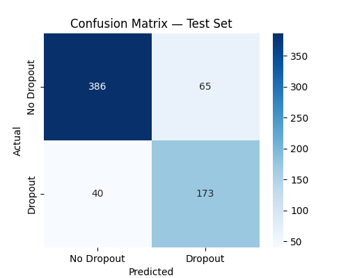
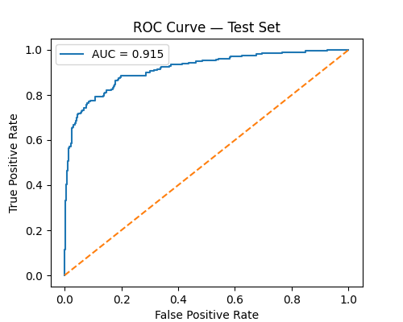
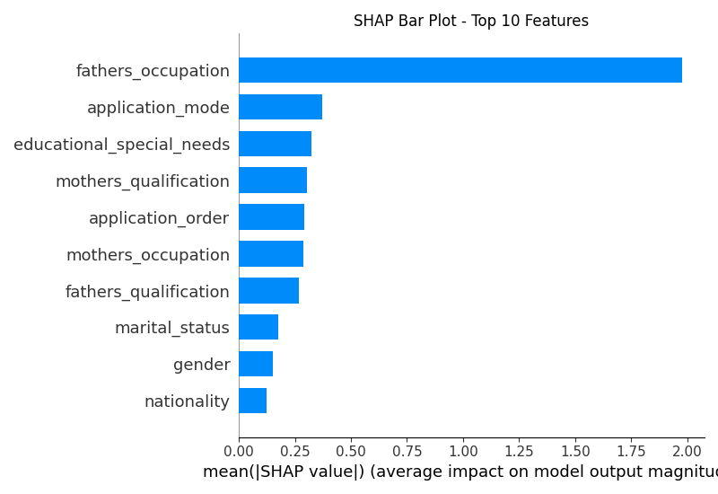
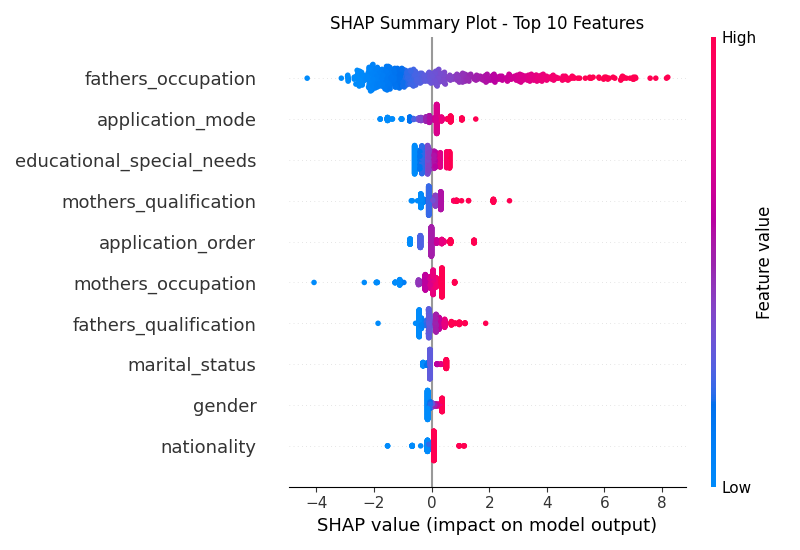
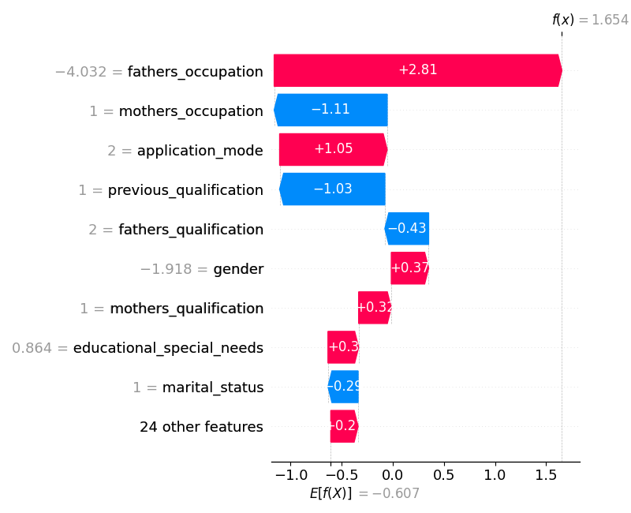
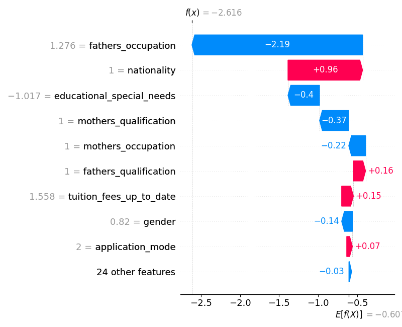

# From Data to Intervention: Predicting Student Dropout Risk Using Machine Learning

## Project Overview

This project applies machine learning to predict student dropout risk using demographic, academic, and institutional data from the **"UCI Predict Students’ Dropout and Academic Success"** dataset.

The objective of this project is not only to build a predictive model, but to develop an early warning system that can help educational institutions identify students at risk of dropping out as early as possible. Early identification allows institutions to provide targeted interventions such as academic support, financial assistance, mentoring, and counseling, which may improve student retention and overall academic success.

This project follows the **CRISP-DM (Cross-Industry Standard Process for Data Mining)** methodology, covering the full machine learning lifecycle: business understanding, data understanding, data preparation, modeling, evaluation, and model interpretation. In addition to predictive performance, this project emphasizes model interpretability using SHAP (SHapley Additive exPlanations) to understand the key factors that influence student dropout and to explain individual predictions.

By combining predictive modeling with explainable AI, this project demonstrates how machine learning can be used not only to predict student outcomes, but also to support data-driven decision-making in educational institutions.

## 1. Business Understanding

### Research Question

Can we predict which students are at risk of dropping out using demographic information and first-semester academic data?

### Objective

The objective of this project is to develop a predictive model that can identify students at risk of dropping out early in their academic journey, allowing institutions to intervene before the student leaves the program.

From an institutional perspective, student dropout has significant academic, social, and financial implications. By identifying at-risk students early, institutions can provide targeted support such as academic advising, tutoring, financial assistance, mentoring, or counseling services.

The goal of this project is therefore not just to build an accurate model, but to develop a decision-support tool that can help educational institutions improve student retention through early intervention.

### Success Criteria

Because the goal is early intervention, **recall for the dropout class** is considered the most important metric. Missing a student who is at risk (false negative) is more costly than incorrectly flagging a student as at risk (false positive), since early support could help prevent dropout.

## 2. Data Understanding

This project uses the **"Predict Students’ Dropout and Academic Success"** dataset from the UCI Machine Learning Repository. The dataset contains **4,424 student records** and includes demographic, academic, financial, and institutional information collected at the time of enrollment.

The target variable indicates whether a student:
- Dropped out
- Remained enrolled
- Graduated

For this project, the problem was framed as a binary classification task, where:
- **Dropout = 1**
- **Enrolled or Graduate = 0**

This framing aligns with the project goal of **early dropout risk detection**, where the objective is to identify students who may leave the institution before completing their program.

### Features

The dataset includes several categories of features, including:
- Demographic information (e.g., age, gender, nationality, marital status)
- Socioeconomic background (e.g., parents’ occupation and education)
- Academic background (e.g., previous qualification, admission grade)
- Institutional information (e.g., application mode, course, attendance type)
- Financial information (e.g., tuition fees status, scholarship status)
- Academic performance (e.g., number of enrolled units, approved units, grades)

Only information for the first semester was used to build the model, ensuring that the model reflects a realistic early prediction scenario and avoids data leakage from future academic performance.

### Initial Exploratory Data Analysis (EDA)

Initial exploratory data analysis was performed to:
- Understand feature distributions
- Identify missing values and data quality issues
- Examine class balance between dropout and non-dropout students
- Explore relationships between key variables and dropout status

The EDA phase helped guide data cleaning, feature engineering, and model selection in later stages of the project.

## 3. Data Preparation

The data preparation phase focused on cleaning the dataset, preventing data leakage, engineering meaningful features, and building a reusable preprocessing pipeline for modeling.

The following steps were performed:
- Removed second-semester variables to prevent data leakage, since the goal is to predict dropout risk early using only information from the first semester.
- Standardized column names for consistency and readability.
- Converted categorical features to appropriate data types for encoding.
- Converted the target variable into a binary classification problem:
  - **Dropout → 1**
  - **Non-dropout (Enrolled or Graduate) → 0**
- Engineered additional hypothesis-driven features to better capture student performance and financial risk:
  - Approval rate (1st semester): ratio of approved units to enrolled units
  - Evaluation participation rate: ratio of evaluations to enrolled units
  - Financial risk flag: indicator based on tuition payment status
- Built a preprocessing pipeline using `ColumnTransformer` to:
  - One-hot encode categorical variables
  - Standardize numerical variables using `StandardScaler`

### Train / Validation / Test Split

The dataset was split into three subsets to ensure proper model evaluation:
- **Training set: 70%**
- **Validation set: 15%**
- **Test set: 15%**

Stratified sampling was used to preserve the dropout class distribution across all subsets, and shuffling was enabled since the observations are independent and do not contain a temporal component.

This setup allows:
- Model training on the training set
- Model selection and hyperparameter tuning on the validation set
- Final unbiased evaluation on the test set

## 4. Data Modeling

During the modeling phase, several machine learning models were developed and evaluated to predict student dropout risk. The modeling process was designed to compare multiple algorithms and select the model that best identified at-risk students.

### Baseline Model

A **Logistic Regression** model was used as the baseline model due to its simplicity, interpretability, and strong performance on classification problems. Logistic Regression also provides interpretable coefficients, which is useful for understanding the factors associated with student dropout.

### Models Evaluated

The following models were trained and evaluated:
- Logistic Regression
- Decision Tree
- Random Forest
- Support Vector Machine (SVM)

All models were implemented using a `scikit-learn` Pipeline that included:
- One-hot encoding for categorical variables
- Standard scaling for numerical variables
- The machine learning model

This pipeline ensured that preprocessing steps were applied consistently across all models and prevented data leakage during cross-validation and model evaluation.

### Hyperparameter Tuning

After comparing the initial model performances on the validation set, the top-performing models were further optimized using `GridSearchCV`. Hyperparameter tuning was performed primarily to improve recall for the dropout class, since identifying at-risk students is the main objective of the project.

The best-performing model after hyperparameter tuning was the **Logistic Regression model with class balancing and regularization**, which was selected as the final model for evaluation on the test set.

## 5. Evaluation

Model performance was evaluated using several classification metrics, including **accuracy, precision, recall, F1 score, and ROC-AUC**. Because the goal of this project is early identification of students at risk of dropping out, **recall for the dropout class** was considered the most important metric. Missing an at-risk student (false negative) is more costly than incorrectly flagging a student as at risk (false positive), since early intervention may help prevent dropout.

### Final Model Performance (Test Set)

The final tuned Logistic Regression model was evaluated on the held-out test set, which was not used during training or model selection. This provides an unbiased estimate of model performance on new, unseen data.

#### Test Set Performance:
- Accuracy: 84.19%
- Precision: 72.69%
- Recall: 81.22%
- F1 Score: 0.7672
- ROC-AUC: 0.9151

The model achieved a **recall of over 81%**, meaning that it successfully identifies the majority of students who are at risk of dropping out. The **ROC-AUC score of 0.915** indicates excellent ability to distinguish between dropout and non-dropout students.

### Confusion Matrix

The confusion matrix shows that the model correctly identifies a large proportion of dropout students while maintaining a reasonable number of false positives. In the context of early intervention, this trade-off is acceptable because it is better to provide support to a student who may not need it than to miss a student who is truly at risk.

### ROC Curve

The ROC curve further confirms that the model has strong discriminatory power across different classification thresholds.

Overall, the evaluation results indicate that the model performs well and is suitable for identifying students at risk of dropping out.

## 6. Model Interpretation (SHAP)

While predictive performance is important, understanding why the model makes certain predictions is equally important, especially in an educational setting where decisions may affect student support and intervention strategies. For this reason, the final model was interpreted using **SHAP (SHapley Additive exPlanations)**.

SHAP is an explainable AI technique that explains how each feature contributes to a model’s prediction. It provides both:
- Global explanations — which features are most important overall
- Local explanations — why the model made a specific prediction for an individual student

To make the SHAP results easier to interpret, one-hot encoded categorical variables were grouped back into their original feature names so that the analysis reflects the importance of the original variables rather than individual encoded categories.

### Global Feature Importance

The SHAP feature importance plot below shows the most influential features affecting dropout predictions.

The most important features include:
- Father’s occupation
- Application mode
- Educational special needs
- Mother’s qualification
- Application order
- Mother’s occupation
- Father’s qualification
- Marital status
- Gender
- Nationality

These results suggest that **socioeconomic background, admission pathway, and academic support needs** are among the most important factors influencing student dropout risk.

### SHAP Summary Plot

The SHAP summary plot shows both the importance and direction of each feature’s impact on dropout predictions.

In this plot:
- Features pushing predictions toward dropout appear on the right
- Features pushing predictions toward non-dropout appear on the left
- Red points represent higher feature values
- Blue points represent lower feature values

The summary plot shows that dropout risk is influenced by a combination of socioeconomic factors, academic preparation, and institutional factors.

### A Tale of Two Outcomes — Local SHAP Explanations

To better understand how the model makes predictions at the individual level, two students from the test set were selected:
- One student who **dropped out**
- One student who **did not drop out**

SHAP waterfall plots were used to break down each prediction into individual feature contributions.

#### Student 1 — Predicted Dropout

For this student, several factors pushed the prediction toward dropout, particularly father’s occupation, application mode, gender, mother’s qualification, and educational special needs. Although some features reduced the predicted risk, the combined effect of the stronger risk factors resulted in a final prediction of dropout.

#### Student 2 — Predicted No Dropout

For this student, several protective factors pushed the prediction toward non-dropout, including father’s occupation, educational special needs, and mother’s qualification. While some risk factors were present, their impact was smaller than the protective factors, resulting in a prediction that the student would continue their studies.

### Comparative Analysis

Comparing these two students shows that dropout risk is determined by the combined effect of multiple factors, rather than a single variable. Students who drop out tend to have several risk factors that accumulate and push the prediction toward dropout, while students who persist tend to have stronger protective factors that outweigh the risks.

This demonstrates how the model can be used as an **early warning system** to identify students who may benefit from additional academic support, financial assistance, mentoring, or counseling.

## Conclusion

This project developed a machine learning model to predict student dropout risk using demographic, academic, financial, and institutional data available at or shortly after enrollment. Several models were evaluated, including Logistic Regression, Decision Trees, Random Forest, and Support Vector Machines. After model comparison and hyperparameter tuning, a tuned Logistic Regression model was selected as the final model.

The final model achieved strong performance on the unseen test set, with a recall of 81% for the dropout class and a ROC-AUC of 0.915, indicating that the model can effectively identify students who are at risk of dropping out.

Using SHAP for model interpretability, the analysis showed that dropout risk is strongly influenced by socioeconomic background (parental occupation and education), admission pathway (application mode and order), and academic support needs (educational special needs). A comparative SHAP analysis (“A Tale of Two Outcomes”) further demonstrated that dropout risk is driven by the combined effect of multiple risk factors and protective factors, rather than a single variable.

Overall, this project demonstrates how machine learning can be used not only to predict student dropout, but also to understand the factors that contribute to dropout risk and support early intervention strategies.

## Recommendations

Based on the findings of this project, the following recommendations can be made for educational institutions:
- Implement an early warning system: Use the predictive model to identify students at risk of dropping out early in their academic journey.
- Provide targeted academic support: Students with educational special needs or weaker academic preparation may benefit from tutoring, mentoring, and academic advising.
- Expand financial support programs: Socioeconomic factors were among the strongest predictors of dropout, suggesting that financial aid and flexible payment options may help reduce dropout risk.
- Monitor admission pathways: Application mode and application order were important predictors, indicating that students entering through certain pathways may require additional support.
- Use the model as a decision-support tool: The model should support academic advisors and administrators in identifying at-risk students and prioritizing intervention efforts.

## Limitations and Future Work

While the model performs well and provides useful insights, this project has several limitations. The model is based on historical data and may not capture all factors that influence student dropout, such as personal motivation, mental health, or family circumstances. In addition, the dataset represents a specific educational context, and model performance may vary when applied to other institutions or student populations.

Future work could include incorporating additional data sources such as attendance records, learning management system activity, or longitudinal academic performance. More advanced models such as gradient boosting or neural networks could also be explored and compared. Finally, the model could be deployed as part of a real-time early warning system that continuously monitors student risk and alerts academic advisors when intervention may be needed.

## Citations

### Data: 

Predict Students' Dropout and Academic Success

### URL
https://archive.ics.uci.edu/dataset/697/predict%2Bstudents%2Bdropout%2Band%2Bacademic%2Bsuccess

### Authors:
M.V.Martins, D. Tolledo, J. Machado, L. M.T. Baptista, V.Realinho. (2021) "Early prediction of student’s performance in higher education: a case study" Trends and Applications in Information Systems and Technologies, vol.1, in Advances in Intelligent Systems and Computing series. Springer. DOI: 10.1007/978-3-030-72657-7_16