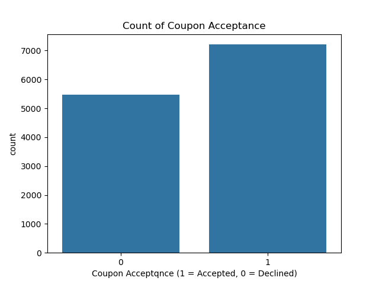
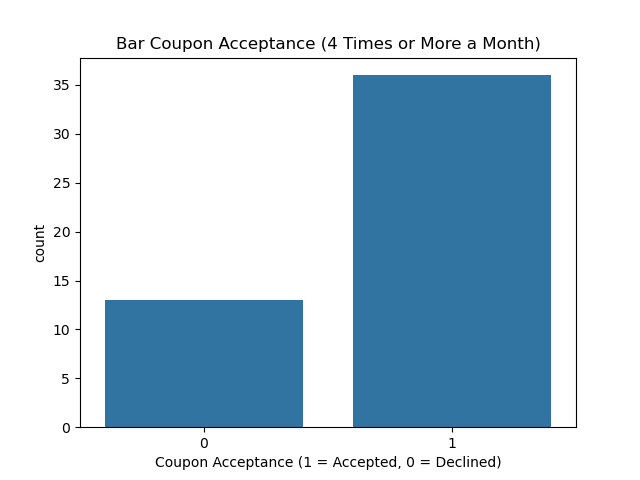
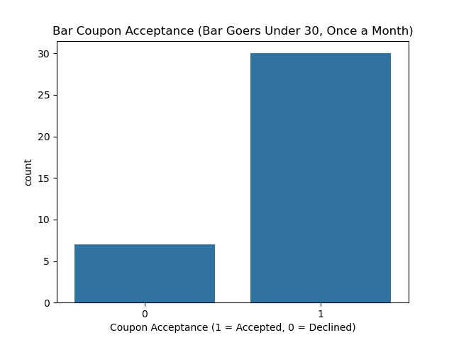

# Practical Appication 1: Will the Customer Accept the Coupon?

The goal of this practical application is to predict whether a customer will accept a coupon. 

To provide some context, coupons of different types (restaurant, bar, coffee house, etc.) are pushed to the cell phones of random drivers who either accept them or decline them. Those drivers are from different demographics, and accepting a coupon means either accepting it right away or accepting it later before it expires.

I'll apply the CRISP-DM framework to answer the business question above.

## 1. Business Understanding 

As previously stated, the business objective is to find out whether a driver will accept a coupon. However, given that there are different types of coupons, and that drivers fall within different demographics, a more specific Business question should be: **What type of driver will accept a given type of coupon?**

## 2. Data Undestanding

The data for the survey comes from the UCI Machine Learning repository. It is extensive; it contains several columns that provide specific attributes of the drivers; and it also contains enough information to analyze the coupons and the contextual attributes of their presentation and acceptance.

## 3. Data Preparation

Although the data is intensive, it does contain the following issues:
- Some columns such as`car`have a lot of missing values
- The `age` column is of type string; so it contans a mix of string and integer values

Therefore, the data has to be cleaned (by fixing the above issues) before it can be used for analysis.

## 4. Modeling

The first step of the analysis is to compute the acceptance rate of all coupons. Overall, 57% of all coupons are accepted, and 43% are declined, as can be seen in the plot below.

The next step is to focus on a specific type of coupons: bar coupons. Overall, only 41% of drivers accepted those coupons. Therefore, to further analyze the specific behavior of the drivers when presented with bar coupons, those drivers were separated into different groups. Different scenarios were then considered, and their acceptance percentages were computed accordingly.

### Scenario 1: Coupon acceptance among drivers who went to a bar 3 or fewer times a month

Among drivers who went to a bar 3 or fewer times a month, 44% accepted the coupons and 56% declined them, as can be seen in the plot below.

### Scenario 2: Coupon acceptance among drivers who went to a bar 4 times or more a month

Among those drivers, 73% accepted the coupons and 23% declined them, as can be seen in the plot below.

### Scenario 3: Coupon acceptance among drivers who went to a bar more than once a month and were over the age of 25

The acceptance rate for those drivers was 73%, which was about the same as that of drivers who went to a bar 4 times or more a month.

### Scenario 4: Coupon acceptance among drivers who went to a bar more than once a month and were under the age of 30

Among those drivers, the acceptance rate was very impressive: 81%. Overall, it was the highest percentage recorded in all the scenarios executed.

## 5. Evaluation

Based on the analysis and charts above, the business question can now be answered:
**The driver will accept the coupon if it is a bar coupon and the driver goes to a bar at least once a month. The acceptance rate will be even higher if the driver is under the age of 30.**

## 6. Deployment

No deployment is necessary for this application since it is a simple data analysis to answer a business question.