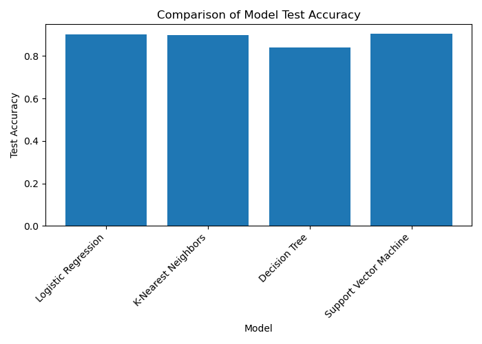

# Practical Application 3: Comparing Classifiers

## Overview

This project compares the performance of four classification models—Logistic Regression, K-Nearest Neighbors, Decision Trees, and Support Vector Machines—using a real-world dataset from a Portuguese bank’s telephone-based marketing campaigns. The objective is to evaluate how effectively each model predicts whether a client will subscribe to a term deposit, while considering both predictive performance and computational cost.

The project follows the CRISP-DM methodology, moving from business understanding and data preparation to modeling, evaluation, and future improvement considerations.

## Business Understanding

The primary business objective is to improve the efficiency of a bank's marketing campaigns by identifying clients who are most likely to subscribe to a long-term deposit product. By accurately predicting positive responses, the bank can reduce unnecessary contact attempts while maintaining or increasing the number of successful subscriptions.

## Dataset

The dataset originates from the UCI Machine Learning Repository and contains information collected from 17 direct marketing campaigns conducted by a Portuguese bank between March 2008 and November 2010.

* **Instances:** 79,354 client contacts
* **Features:** 21 total attributes
* **Target Variable:** Whether the client subscribed to a term deposit (`yes` / `no`)

The features include client demographics, campaign-related information, and economic indicators.

---

## Data Understanding and Preparation

### Feature Overview

* Numeric features include age, campaign statistics, and economic indicators.
* Categorical features describe client attributes and campaign context.

The `duration` feature was excluded from modeling due to target leakage, as it is only known after a call has completed.

### Encoding and Preprocessing

* Categorical features were encoded using one-hot encoding.
* Numeric features were standardized using `StandardScaler` to ensure comparable feature scales.
* The target variable was encoded as a binary numeric value.

All preprocessing steps were applied prior to the train/test split using `scikit-learn` pipelines to avoid data leakage.

---

## Train/Test Split

The dataset was split into training and testing sets using an 80/20 split. Stratification was applied to preserve the original class distribution in both subsets, and a fixed random state was used to ensure reproducibility.

---

## Baseline Performance

A naïve baseline classifier that always predicts the majority class (`no`) was used to establish a minimum performance threshold. Due to class imbalance, this baseline achieves relatively high accuracy without learning any meaningful patterns. All trained models were evaluated against this baseline.

---

## Modeling Approach

Four classification models were trained with default parameters:

* Logistic Regression
* K-Nearest Neighbors (KNN)
* Decision Tree
* Support Vector Machine (SVM)

Each model was evaluated using training time, training accuracy, and test accuracy. Consistent preprocessing and evaluation procedures were used to ensure a fair comparison.

---

## Model Comparison Results

The results show clear trade-offs between training time and predictive performance:

* **Logistic Regression** provides strong baseline performance with fast training time.
* **KNN** trains quickly but shows poor test accuracy relative to the baseline.
* **Decision Tree** achieves high training accuracy but relatively low test accuracy.
* **SVM** achieves the highest test accuracy, although it requires significantly longer training time.

These results highlight the importance of balancing model complexity, performance, and computational cost.

---

## Visualization

A bar plot was used to compare test accuracy across all models, providing a clear visual comparison of their relative performance.

---

## Improving the Model

Several strategies could further improve model performance:

* **Hyperparameter tuning** using grid search and cross-validation
* **Alternative evaluation metrics** such as precision, recall, F1-score, and ROC AUC
* **Model-specific optimization**, particularly for KNN, Decision Trees, and SVM

These steps would help refine model selection and better align predictions with business goals.

---

## Conclusion

This project demonstrates how different classification models perform on a real-world marketing dataset when evaluated under consistent conditions. While the SVM model achieved the highest predictive accuracy, simpler models such as Logistic Regression provided competitive performance with significantly lower computational cost. The final model choice depends on the desired balance between accuracy, interpretability, and efficiency.

---

## Technologies Used

* Python
* pandas
* scikit-learn
* matplotlib

---
