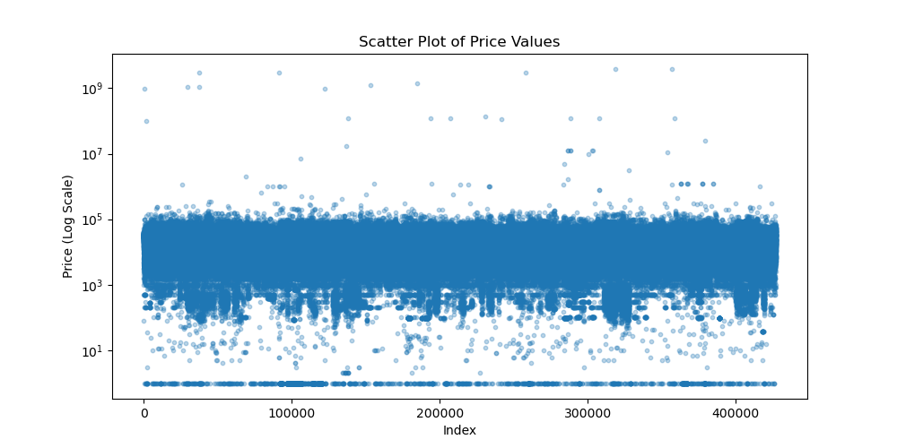

# Practical Appication 2: What Drives the Price of a Car?

This goal of this project is to analyze more than 400,000 used-car listings and identify the key factors that influence the price of a used car. 

It uses Machine Learning techniques to build a model for predicting used car sales. It then evaluates those predictions to make recommendations to used-car delears, helping them make informed pricing decisions and inventory optimization.

I'll apply the CRISP-DM framework to describe the process for analyzing the data, building the model, and achieving the intended business objective.

## 1. Business Understanding 

Used-car dealers need a reliable way to estimate the prices of their vehicles and to understand which features most strongly affect those prices.

As previously stated, the goal of this project is to identify those features. So the main business question can be stated as follows: **Which features most strongly affect the price of a used car, and which regression model provides the most accurate price predictions?**

## 2. Data Undestanding

The dataset contained 426,880 used-car listings. It had an extensive set of vehicle features, such as:

- Year
- Manufacturer
- Model
- Condition
- Cylinders
- Fuel Type
- Title Status
- Transmission
- Odometer
- Title status
- Paint color

Overall, its size and contents were appropriate for training and testing a predictive model.

## 3. Data Preparation

The initial analysis of the dataset revealed that there were significant outliers in the price column. For instance, the maximum price was $3,736,929,000, and the standard deviation was 12,182,280. 

To confirm the presence of outliers, a scatter plot of the data was created, as shown below.

Obviously, the data had to be cleaned and preprocessed before being used for modeling, That cleaning and preprocessing involved the following steps:

- **Outlier filtering:** Creating a sample with prices between $500 and $200,000 based on Google search.
- **Type conversion:** Converting numeric fields such as `year`, `odometer`, and `cylinders` to integer.
- **Categorical encoding:** Applying `OneHotEncoder` transformation to categorical features such as `manufacturuer`, `model` and `condition`, 
- **Missing values:** Using `SimpleImputer` to handle missing numeric and categorical values
- **Feature engineering:** Adding polynomial features (`degree = 3`) to numeric fields.
- **`ColumnTransformer` pipeline**: Ensuring numeric and categorical preprocessing steps were isolated and applied correctly.

This produced a clean dataset ready for modeling.

## 4. Modeling

First, the dataset was split into two sets: **70%** for training and **30%** for testing.

Next, two regression models were created:

- A baseline **Linear Regression** model
- A **Ridge Regression** model (L2 regularization)

The models were then trained and evaluated using their **Mean Squared Error (MSE)**.

The Linear Regression model delivered an MSE of **62284654** and an RNSE of **7892**, meaning that its predictions were off by **$7,892**.

The Ridge Regression model delivered the best performance, with an MSE of **50598928** and an RMSE of **7113**. Its predictions were off by **$7,113**. 

As a result, we chose Ridge as our best model.

## 5. Evaluation

To identify the top 5 features, the Ridge feature names and coefficients were grouped by their parent feature names (for instance, `categorical__model_Lamborghini Huracan` → `model`).

Those top 5 feature were:

1. **Model**
2. **Manufacturer**
3. **Year**
4. **Fuel Type**
5. **Odometer**

A plot was created to show their relative importance.

## 6. Deployment (Briefing and Recommendations)

The findings were presented to the target audience, a group of used-car dealers. The following recommendations were then made:

- Prioritizing high-demand models from well-known manufacturers.
- Updating their inventory with newer model years and vehicles with low mileage.
- Adding vehicles with the most desirable fuel types to their inventory if necessary.

A future version of the model will include additional features and improved algorithms, thus making even better predictions.